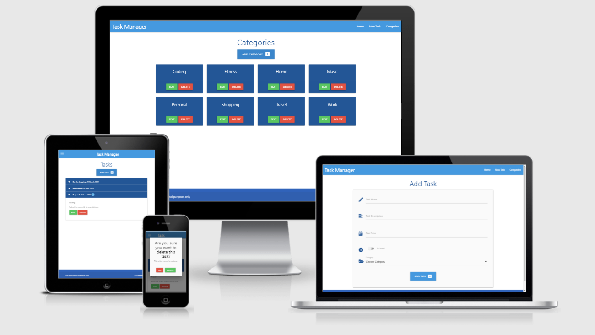
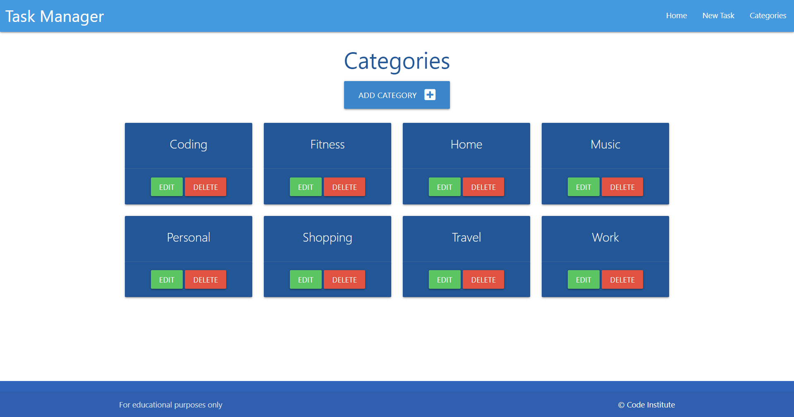
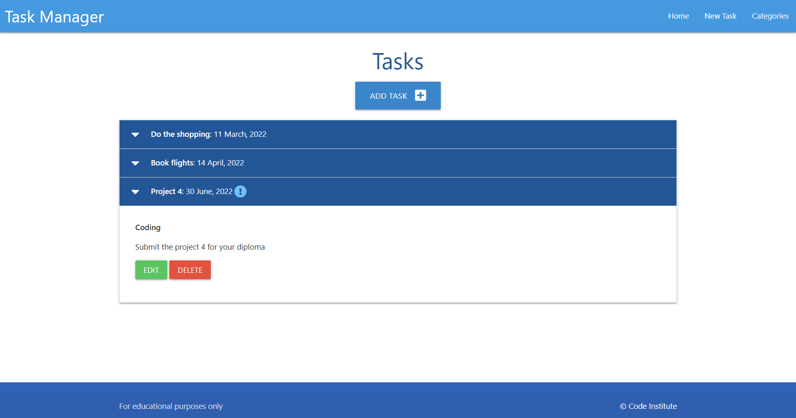
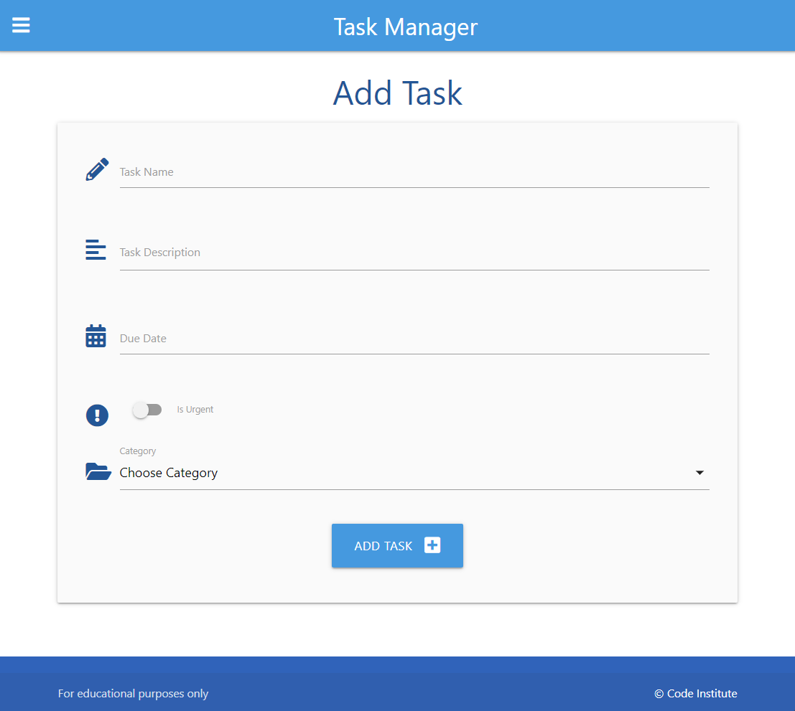
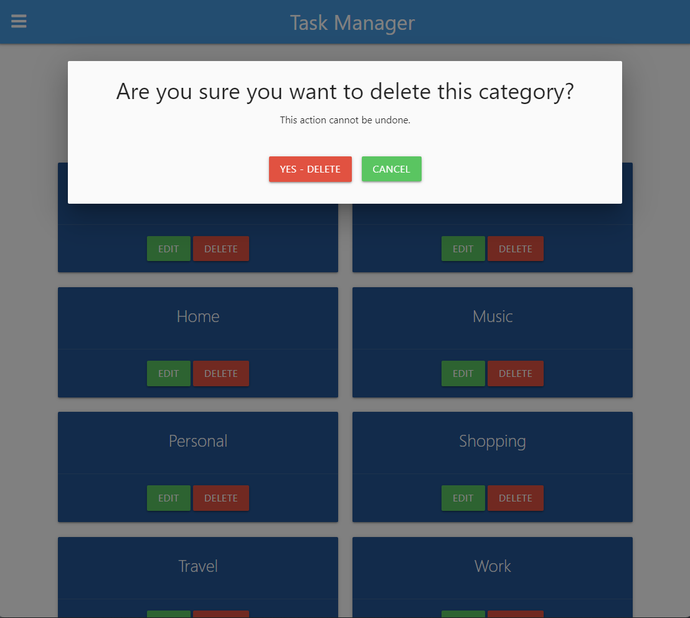

# Task Manager

Relational Database Management System mini-project created via Code Institute as part of Diploma in Full Stack Software Development. 

This task manager was built using Flask, the SLQAlchemy ORM and a frontend framework called Materialize.

- In addition to walk-through material I have added additional functionality to confirm user decision to delete either existing task or task category with use of modals.

[Link to deployed project](http://task-manager--flask-sqlalchemy.herokuapp.com/)

Click here to view project screenshots

